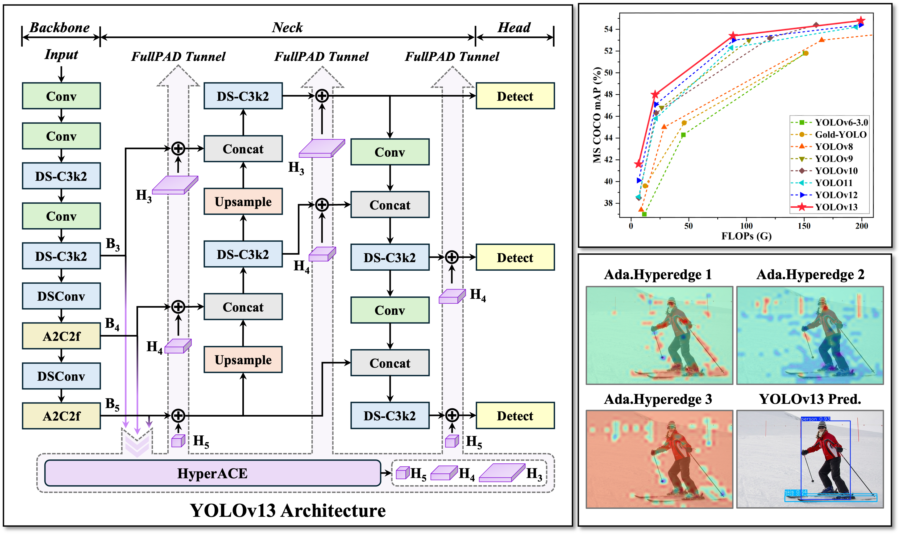

<p align="center">
    
<p>
<h2 align="center">YOLOv13: Real-Time Object Detection with Hypergraph-Enhanced Adaptive Visual Perception</h2>

<p align="center">
    <a href="https://arxiv.org/abs/2506.17733">
    
  </a>
  <a href="https://github.com/iMoonLab">
    
  </a>
</p>

  
<div align="center">
    
</div>

## Updates

- 2025/01/XX:  **项目部署和运行指南更新** - 添加了完整的部署流程、环境配置、数据集准备和运行脚本
- 2025/01/XX: **CUDA/GPU 环境配置指南** - 解决了 OpenCV 依赖和 GPU 设备配置问题
- 2025/01/XX: **数据集配置优化** - 修复了 COCO 数据集配置文件路径问题
- 2025/06/27: [Converting YOLOv13](https://github.com/kaylorchen/ai_framework_demo) to Huawei Ascend (OM), Rockchip (RKNN) formats is supported. Thanks to [kaylorchen](https://github.com/kaylorchen)!
- 2025/06/25: [FastAPI REST API](https://github.com/iMoonLab/yolov13/tree/main/examples/YOLOv13-FastAPI-REST-API) is supported. Thanks to [MohibShaikh](https://github.com/MohibShaikh)!
- 2025/06/24:  **The paper of YOLOv13 can be downloaded**: [ YOLOv13: Real-Time Object Detection with Hypergraph-Enhanced Adaptive Visual Perception](https://arxiv.org/abs/2506.17733).
- 2025/06/24: [Android deployment](https://github.com/mpj1234/ncnn-yolov13-android/tree/main) is supported. Thanks to [mpj1234](https://github.com/mpj1234)!
- 2025/06/22: YOLOv13 model weights released.
- 2025/06/21: The code of YOLOv13 has been open-sourced.

<h2>Table of Contents</h2>

- [Technical Briefing 💡](#technical-briefing-)
- [Main Results ](#main-results-)
  - [1. MS COCO Benchmark](#1-ms-coco-benchmark)
  - [2. Visualizations](#2-visualizations)
- [Quick Start 🚀](#quick-start-)
  - [1. Environment Setup](#1-environment-setup)
  - [2. Install Dependencies](#2-install-dependencies)
  - [3. Dataset Preparation](#3-dataset-preparation)
  - [4. Model Training](#4-model-training)
  - [5. Model Validation](#5-model-validation)
  - [6. Model Prediction](#6-model-prediction)
  - [7. Model Export](#7-model-export)
- [Troubleshooting ](#troubleshooting-)
- [Related Projects ](#related-projects-)
- [Cite YOLOv13 ](#cite-yolov13-)

## Technical Briefing 

**Introducing YOLOv13**—the next-generation real-time detector with cutting-edge performance and efficiency. YOLOv13 family includes four variants: Nano, Small, Large, and X-Large, powered by:

* **HyperACE: Hypergraph-based Adaptive Correlation Enhancement**
  * Treats pixels in multi-scale feature maps as hypergraph vertices.
  * Adopts a learnable hyperedge construction module to adaptively exploring high-order correlations between vertices.
  * A message passing module with linear complexity is leveraged to effectively aggregate multi-scale features with the guidance of high-order correlations to achieve effective visual perception of complex scenarios.

* **FullPAD: Full-Pipeline Aggregation-and-Distribution Paradigm**
  * Uses the HyperACE to aggregate multi-scale features of the backbone and extract high-order correlations in the hypergraph space.
  * FullPAD paradigm further leverages three separate tunnels to forward these correlation-enhanced features to the connection between the backbone and neck, the internal layers of the neck, and the connection between the neck and head, respectively. In this way, YOLOv13 achieves fine‑grained information flow and representational synergy across the entire pipeline.
  * FullPAD significantly improves gradient propagation and enhances the detection performance.

* **Model Lightweighting via DS-based Blocks**
  * Replaces large-kernel convolutions with blocks building based on depthwise separable convolutions (DSConv, DS-Bottleneck, DS-C3k, DS-C3k2), preserving receptive field while greatly reducing parameters and computation.
  * Achieves faster inference speed without sacrificing accuracy.

> YOLOv13 seamlessly combines hypergraph computation with end-to-end information collaboration to deliver a more accurate, robust, and efficient real-time detection solution.

## Main Results 🏆

### 1. MS COCO Benchmark

**Table 1. Quantitative comparison with other state-of-the-art real-time object detectors on the MS COCO dataset**

| **Method** | **FLOPs (G)** | **Parameters(M)** | **AP<sub>50:95</sub><sup>val</sup>** | **AP<sub>50</sub><sup>val</sup>** | **AP<sub>75</sub><sup>val</sup>** | **Latency (ms)** |
| :--- | :---: | :---: | :---: | :---: | :---: | :---: |
| YOLOv6-3.0-N | 11.4 | 4.7 | 37.0 | 52.7 | – | 2.74 |
| Gold-YOLO-N | 12.1 | 5.6 | 39.6 | 55.7 | – | 2.97 |
| YOLOv8-N | 8.7 | 3.2 | 37.4 | 52.6 | 40.5 | 1.77 |
| YOLOv10-N | 6.7 | 2.3 | 38.5 | 53.8 | 41.7 | 1.84 |
| YOLO11-N | 6.5 | 2.6 | 38.6 | 54.2 | 41.6 | 1.53 |
| YOLOv12-N | 6.5 | 2.6 | 40.1 | 56.0 | 43.4 | 1.83 |
| **YOLOv13-N** | **6.4** | **2.5** | **41.6** | **57.8** | **45.1** | **1.97** |
|           |           |            |                 |           | 
| YOLOv6-3.0-S | 45.3 | 18.5 | 44.3 | 61.2 | – | 3.42 |
| Gold-YOLO-S | 46.0 | 21.5 | 45.4 | 62.5 | – | 3.82 |
| YOLOv8-S | 28.6 | 11.2 | 45.0 | 61.8 | 48.7 | 2.33 |
| RT-DETR-R18 | 60.0 | 20.0 | 46.5 | 63.8 | – | 4.58 |
| RT-DETRv2-R18 | 60.0 | 20.0 | 47.9 | 64.9 | – | 4.58 |
| YOLOv9-S | 26.4 | 7.1 | 46.8 | 63.4 | 50.7 | 3.44 |
| YOLOv10-S | 21.6 | 7.2 | 46.3 | 63.0 | 50.4 | 2.53 |
| YOLO11-S | 21.5 | 9.4 | 45.8 | 62.6 | 49.8 | 2.56 |
| YOLOv12-S | 21.4 | 9.3 | 47.1 | 64.2 | 51.0 | 2.82 |
| **YOLOv13-S** | **20.8** | **9.0** | **48.0** | **65.2** | **52.0** | **2.98** |
|           |           |            |                 |           | 
| YOLOv6-3.0-L | 150.7 | 59.6 | 51.8 | 69.2 | – | 9.01 |
| Gold-YOLO-L | 151.7 | 75.1 | 51.8 | 68.9 | – | 10.69 |
| YOLOv8-L | 165.2 | 43.7 | 53.0 | 69.8 | 57.7 | 8.13 |
| RT-DETR-R50 | 136.0 | 42.0 | 53.1 | 71.3 | – | 6.93 |
| RT-DETRv2-R50 | 136.0 | 42.0 | 53.4 | 71.6 | – | 6.93 |
| YOLOv9-C | 102.1 | 25.3 | 53.0 | 70.2 | 57.8 | 6.64 |
| YOLOv10-L | 120.3 | 24.4 | 53.2 | 70.1 | 57.2 | 7.31 |
| YOLO11-L | 86.9 | 25.3 | 52.3 | 69.2 | 55.7 | 6.23 |
| YOLOv12-L | 88.9 | 26.4 | 53.0 | 70.0 | 57.9 | 7.10 |
| **YOLOv13-L** | **88.4** | **27.6** | **53.4** | **70.9** | **58.1** | **8.63** |
|           |           |            |                 |           | 
| YOLOv8-X | 257.8 | 68.2 | 54.0 | 71.0 | 58.8 | 12.83 |
| RT-DETR-R101 | 259.0 | 76.0 | 54.3 | 72.7 | – | 13.51 |
| RT-DETRv2-R101| 259.0 | 76.0 | 54.3 | 72.8 | – | 13.51 |
| YOLOv10-X | 160.4 | 29.5 | 54.4 | 71.3 | 59.3 | 10.70 |
| YOLO11-X | 194.9 | 56.9 | 54.2 | 71.0 | 59.1 | 11.35 |
| YOLOv12-X | 199.0 | 59.1 | 54.4 | 71.1 | 59.3 | 12.46 |
| **YOLOv13-X** | **199.2** | **64.0** | **54.8** | **72.0** | **59.8** | **14.67** |

### 2. Visualizations

<div>
    
</div>

**Visualization examples of YOLOv10-N/S, YOLO11-N/S, YOLOv12-N/S, and YOLOv13-N/S.**

<div>
    
</div>

**Representative visualization examples of adaptive hyperedges. The hyperedges in the first and second columns mainly focus on the high-order interactions among objects in the foreground. The third column mainly focuses on the high-order interactions between the background and part of the foreground. The visualization of these hyperedges can intuitively reflect the high-order visual associations modeled by the YOLOv13.**

## Quick Start 🚀

### 1. Environment Setup

#### 1.1 系统要求
- Python 3.9+
- CUDA 11.0+ (可选，用于GPU加速)
- 至少 8GB RAM
- 推荐使用 Linux 系统

#### 1.2 创建 Conda 环境
```bash
# 创建新的conda环境
conda create -n yolo13 python=3.9 -y

# 激活环境
conda activate yolo13

# 接受conda服务条款（如果遇到错误）
conda tos accept --override-channels --channel https://repo.anaconda.com/pkgs/main
conda tos accept --override-channels --channel https://repo.anaconda.com/pkgs/r
```

### 2. Install Dependencies

#### 2.1 配置镜像源（推荐国内用户）
```bash
# 配置pip镜像源
mkdir -p ~/.pip
cat > ~/.pip/pip.conf << EOF
[global]
index-url = https://pypi.tuna.tsinghua.edu.cn/simple/
trusted-host = pypi.tuna.tsinghua.edu.cn
EOF

# 配置conda镜像源
conda config --add channels https://mirrors.tuna.tsinghua.edu.cn/anaconda/pkgs/main/
conda config --add channels https://mirrors.tuna.tsinghua.edu.cn/anaconda/cloud/conda-forge/
conda config --set show_channel_urls yes
```

#### 2.2 安装依赖
```bash
# 升级pip
pip install --upgrade pip

# 安装项目依赖
pip install -r requirements.txt

# 安装项目本身
pip install -e .
```

#### 2.3 解决OpenCV依赖问题（如果遇到）
```bash
# 安装OpenGL相关库
apt-get update
apt-get install -y libgl1-mesa-glx libglib2.0-0 libsm6 libxext6 libxrender-dev libgomp1

# 或者使用headless版本的OpenCV
pip uninstall opencv-python
pip install opencv-python-headless
```

### 3. Dataset Preparation

#### 3.1 下载COCO数据集
```bash
cd datasets
wget https://github.com/ultralytics/assets/releases/download/v0.0.0/coco2017labels.zip
unzip coco2017labels.zip
```

#### 3.2 配置数据集文件
创建 `datasets/coco/coco.yaml` 文件：
```yaml
# COCO 2017 dataset configuration
path: ../datasets/coco  # dataset root dir
train: images/train2017  # train images (relative to 'path')
val: images/val2017  # val images (relative to 'path')
test:  # test images (optional)

# Classes (COCO has 80 classes)
nc: 80  # number of classes

# Class names (COCO 2017)
names:
  0: person
  1: bicycle
  # ... (完整列表见下方)
  79: toothbrush
```

### 4. Model Training

#### 4.1 准备预训练权重
下载预训练模型到 `model/` 目录：
- [YOLOv13-N](https://github.com/iMoonLab/yolov13/releases/download/yolov13/yolov13n.pt)
- [YOLOv13-S](https://github.com/iMoonLab/yolov13/releases/download/yolov13/yolov13s.pt)
- [YOLOv13-L](https://github.com/iMoonLab/yolov13/releases/download/yolov13/yolov13l.pt)
- [YOLOv13-X](https://github.com/iMoonLab/yolov13/releases/download/yolov13/yolov13x.pt)

#### 4.2 训练脚本
```python
# train.py
from ultralytics import YOLO

# 加载预训练模型
model = YOLO('model/yolov13n.pt')

# 训练模型
results = model.train(
    data='datasets/coco/coco.yaml',
    epochs=600, 
    batch=256, 
    imgsz=640,
    scale=0.5,
    mosaic=1.0,
    mixup=0.0,
    copy_paste=0.1,
    device="cpu",  # 使用CPU，如果有GPU改为"0"或"0,1,2,3"
    project='runs/train',
    name='yolov13_coco',
    save=True,
    save_period=50,
)
```

### 5. Model Validation

```python
# val.py
from ultralytics import YOLO

model = YOLO('model/yolov13s.pt')

results = model.val(
    data='datasets/coco/coco.yaml',
    imgsz=640,
    batch=16,
    device="cpu",  # 或 "0" 用于GPU
    save_json=True,
    save_txt=True,
    project='runs/val',
    name='yolov13_validation',
)
```

### 6. Model Prediction

```python
# predict.py
from ultralytics import YOLO

model = YOLO('model/yolov13n.pt')

results = model.predict(
    source='path/to/your/image.jpg',
    imgsz=640,
    conf=0.25,
    iou=0.45,
    device="cpu",  # 或 "0" 用于GPU
    save=True,
    project='runs/predict',
    name='yolov13_prediction',
)
```

### 7. Model Export

```python
# export.py
from ultralytics import YOLO

model = YOLO('model/yolov13n.pt')

# 导出为ONNX格式
model.export(format="onnx", half=True, imgsz=640)

# 导出为TensorRT格式
model.export(format="engine", half=True, imgsz=640)
```

### 8. 便捷运行脚本

项目提供了便捷的运行脚本，位于 `run_script/` 目录：

```bash
# 给脚本添加执行权限
chmod +x run_script/*.sh

# 运行训练
./run_script/run_training.sh

# 运行验证
./run_script/run_validation.sh

# 运行预测
./run_script/run_prediction.sh

# 运行导出
./run_script/run_export.sh

# 交互式选择操作
./run_script/run_all.sh
```

## Troubleshooting 🔧

### 常见问题及解决方案

#### 1. CUDA/GPU 相关问题
**问题**: `ValueError: Invalid CUDA 'device=0,1,2,3' requested`
**解决**: 
- 检查GPU可用性: `python -c "import torch; print(torch.cuda.is_available())"`
- 如果无GPU，将 `device="0,1,2,3"` 改为 `device="cpu"`

#### 2. OpenCV 依赖问题
**问题**: `ImportError: libGL.so.1: cannot open shared object file`
**解决**:
```bash
apt-get install -y libgl1-mesa-glx libglib2.0-0 libsm6 libxext6 libxrender-dev libgomp1
# 或使用headless版本
pip install opencv-python-headless
```

#### 3. 数据集下载问题
**问题**: 数据集下载失败或链接失效
**解决**:
- 使用国内镜像源
- 手动下载数据集到正确位置
- 检查网络连接

#### 4. 内存不足问题
**解决**:
- 减小batch size: `batch=64` 或更小
- 使用CPU训练: `device="cpu"`
- 增加系统内存或使用云服务器

### 环境检查脚本
```python
# test_environment.py
import torch
import cv2
import ultralytics

print(f"PyTorch version: {torch.__version__}")
print(f"CUDA available: {torch.cuda.is_available()}")
print(f"CUDA device count: {torch.cuda.device_count()}")
print(f"OpenCV version: {cv2.__version__}")
print(f"Ultralytics version: {ultralytics.__version__}")
```

## Related Projects 🔗

- The code is based on [Ultralytics](https://github.com/ultralytics/ultralytics). Thanks for their excellent work!
- Other wonderful works about Hypergraph Computation:
  - "Hypergraph Neural Networks": [[paper](https://arxiv.org/abs/1809.09401)] [[code](https://github.com/iMoonLab/HGNN)]
  - "HGNN+: General Hypergraph Nerual Networks": [[paper](https://ieeexplore.ieee.org/abstract/document/9795251)] [[code](https://github.com/iMoonLab/DeepHypergraph)]
  - "SoftHGNN: Soft Hypergraph Neural Networks for General Visual Recognition": [[paper](https://arxiv.org/abs/2505.15325)] [[code](https://github.com/Mengqi-Lei/SoftHGNN)]

## Cite YOLOv13 📝

If you use YOLOv13 in your research, please cite our paper:

```bibtex
@article{yolov13,
  title={YOLOv13: Real-Time Object Detection with Hypergraph-Enhanced Adaptive Visual Perception},
  author={Lei, Mengqi and Li, Siqi and Wu, Yihong and et al.},
  journal={arXiv preprint arXiv:2506.17733},
  year={2025}
}
```

---

**Note**: This project is based on the original YOLOv13 implementation by [iMoonLab](https://github.com/iMoonLab). The deployment and configuration guide has been enhanced with practical experience and troubleshooting solutions.

